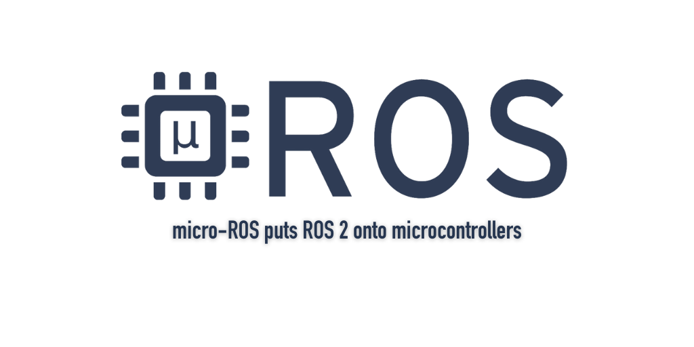

<a>
   

      
   

</a>

# Get in touch!

Learn more about what we're doing in open source at [micro.ros.org](https://micro.ros.org) and [NEWS](https://micro.ros.org/blog/2021/09/08/MicrosoftAzureRTOS/) section.

